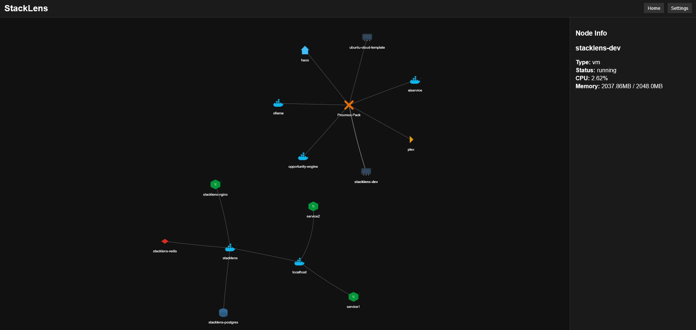

# StackLens

<p align="center">
  <strong>Infrastructure Discovery & Dependency Mapping for Homelabs</strong>
</p>

<p align="center">
  Understand your infrastructure automatically.
</p>

<p align="center">
  
  
  
  
</p>

---

## Demo

<p align="center">
  
</p>

---

## What is StackLens?

StackLens is a **self-hosted infrastructure discovery tool** designed for homelabs and self-hosted environments.

It automatically detects services running in your infrastructure and maps how they depend on each other.

Over time homelabs grow into complex systems of containers, services, databases, and networks. StackLens aims to provide a **live map of that infrastructure** so you can understand:

- what services are running  
- where they are running  
- how they interact  
- what breaks if something fails  

Think of StackLens as **Google Maps for your homelab infrastructure**.

---

## Example Infrastructure Map (Vision)

```
Proxmox
   │
Docker Host
   │
Mosquitto
   │
Zigbee2MQTT
   │
Home Assistant
```

StackLens will automatically detect and visualize relationships like this.

---

## Current Capabilities

StackLens is currently in an **early prototype stage**, but several core features are already working.

### Infrastructure Discovery

- Docker container discovery
- Proxmox node discovery
- Proxmox VM detection
- Proxmox LXC detection
- Network service scanning

### Infrastructure Visualization

- Interactive topology graph
- Service icon detection
- Docker stack grouping

### Service Operations

From the UI you can:

- view container logs  
- restart containers  
- stop containers  
- inspect service status  

---

## Installation (Prototype)

Clone the repository:

```bash
git clone https://github.com/gregapackard/stacklens.git
cd stacklens
```

Install dependencies:

```bash
pip install -r requirements.txt
```

Run the API server:

```bash
uvicorn backend.main:app --host 0.0.0.0 --port 8000
```

Open the UI:

```
http://localhost:8000/ui
```

---

## Project Structure

```
backend/
  scanner/        infrastructure discovery engines
  graph/          graph construction logic
  main.py         FastAPI server

frontend/
  js/             graph rendering logic
  icons/          service icons
  index.html      UI
```

---

## Planned Features

StackLens is designed to evolve into a full **infrastructure intelligence platform**.

Planned capabilities include:

- Docker network discovery
- Automatic service dependency detection
- Failure impact simulation
- Multi-host discovery
- Kubernetes discovery
- Plugin system for integrations
- Infrastructure snapshots
- AI-assisted infrastructure diagnostics

---

## Project Vision

Modern homelabs increasingly resemble **small data centers**.

StackLens aims to provide:

- infrastructure visibility
- automated discovery
- service relationship mapping
- operational insight

The goal is to make it easy to understand **how your infrastructure actually works**.

---

## Contributing

Contributions are welcome once the project stabilizes.

Early development is focused on building the **core infrastructure discovery engine**.

---

## License

License will be determined as the project matures.
